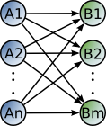
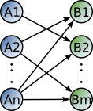
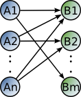
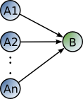
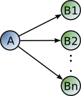
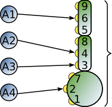

# Connection Management

From NEST 2.4 onwards the old connection routines (i.e.
`(Random)ConvergentConnect`, `(Random)DivergentConnect` and plain `Connect`) are
replaced by one unified `Connect` function. In
[SLI](an-introduction-to-sli.md)
,the old syntax of the function still works, while in
[PyNEST](introduction-to-pynest.md), the `Connect()`
function has been renamed to `OneToOneConnect()`. However, simple cases, which
are just creating one-to-one connections between two lists of nodes are still
working with the new command without the need to change the code. Note that the
topology-module is not effected by theses changes. The translation between the
old and the new connect routines is described in [Old Connection Routines](connection-management.md#old-connection-routines).

The connectivity pattern is defined inside the `Connect()` function under the
key 'rule'. The patterns available are described in
[Connection Rules](connection-management.md#connection-rules). In
addition the synapse model can be specified within the connect function and all
synaptic parameters can be randomly distributed.

The `Connect()` function can be called in either of the following manners:

    Connect(pre, post)
    Connect(pre, post, conn_spec)
    Connect(pre, post, conn_spec, syn_spec)

`pre` and `post` are lists of Global Ids defining the nodes of origin and
termination.

`conn_spec` can either be a string containing the name of the connectivity rule
(default: 'all\_to\_all') or a dictionary specifying the rule and the
rule-specific parameters (e.g. 'indegree'), which must be given.

In addition switches allowing self-connections ('autapses', default: True) and
multiple connections between pairs of neurons ('multapses', default: True) can
be contained in the dictionary. The validity of the switches is confined by the
Connect-call. Thus connecting the same set of neurons multiple times with the
switch 'multapses' set to False, one particular connection might be established
multiple times. The same applies to nodes being specified multiple times in the
source or target vector. Here 'multapses' set to False will result in one
potential connection between each occurring node pair.

`syn_spec` defines the synapse type and its properties. It can be given as a
string defining the synapse model (default: 'static\_synapse') or as a
dictionary. By using the key-word variant (`Connect(pre, post,
syn_spec=syn_spec_dict)`), the conn\_spec can be omitted in the call to
connect and 'all\_to\_all' is assumed as the default.
The exact usage of the synapse dictionary is described in [Synapse Specification](connection-management.md#synapse-specification).

## Connection Rules

Connection rules are specified using the `conn_spec` parameter, which can be a
string naming a connection rule or a dictionary containing a rule specification.
Only connection rules requiring no parameters can be given as strings, for all
other rules, a dictionary specifying the rule and its parameters, such as in-
or out-degrees, is required.

## one-to-one

The ith node in `pre` is connected to the ith node in
`post`. The node lists pre and post have to be of the same length.

Example:

one-to-one connections

    n = 10
    A = Create("iaf_neuron", n)
    B = Create("spike_detector", n)
    Connect(A, B, 'one_to_one')

This rule can also take two Global IDs A and B instead of integer lists. A
shortcut is provided if only two nodes are connected with the parameters weight
and delay such that weight and delay can be given as third and fourth argument
to the Connect() function.

Example:

    weight = 1.5
    delay = 0.5
    Connect(A[0], B[0], weight, delay)

## all-to-all

all-to-all connections

Each node in `pre` is connected to every node in `post`. Since 'all\_to\_all' is
the default, 'rule' doesn't need to specified.

Example:

    n, m = 10, 12
    A = Create("iaf_neuron", n)
    B = Create("iaf_neuron", m)
    Connect(A, B)

### fixed-indegree

fixed-indegree connections

The nodes in `pre` are randomly connected with the nodes in `post` such that
each node in `post` has a fixed `indegree`.

Example:

    n, m, N = 10, 12, 2
    A = Create("iaf_neuron", n)
    B = Create("iaf_neuron", m)
    conn_dict = {'rule': 'fixed_indegree', 'indegree': N}
    Connect(A, B, conn_dict)

#### fixed-outdegree

fixed-outdegree connections

The nodes in `pre` are randomly connected with the nodes in `post` such that
each node in `pre` has a fixed `outdegree`.

Example:

    n, m, N = 10, 12, 2
    A = Create("iaf_neuron", n)
    B = Create("iaf_neuron", m)
    conn_dict = {'rule': 'fixed_outdegree', 'outdegree': N}
    Connect(A, B, conn_dict)

#### fixed-total-number

The nodes in `pre` are randomly connected with the nodes in `post` such that the
total number of connections equals `N`.

Example:

    n, m, N = 10, 12, 30
    A = Create("iaf_neuron", n)
    B = Create("iaf_neuron", m)
    conn_dict = {'rule': 'fixed_total_number', 'N': N}
    Connect(A, B, conn_dict)

#### pairwise-bernoulli

For each possible pair of nodes from `pre` and `post`, a connection is created
with probability `p`.

Example:

    n, m, p = 10, 12, 0.2
    A = Create("iaf_neuron", n)
    B = Create("iaf_neuron", m)
    conn_dict = {'rule': 'pairwise_bernoulli', 'p': p}
    Connect(A, B, conn_dict)

### Synapse Specification

The synapse properties can be given as a string or a dictionary. The string can
be the name of a pre-defined synapse which can be found in the synapsedict (see
[Synapse Types](connection-management.md#synapse-types)) or a
manually defined synapse via `CopyModel()`.

Example:

    n = 10
    A = Create("iaf_neuron", n)
    B = Create("iaf_neuron", n)
    CopyModel("static_synapse","excitatory",{"weight":2.5, "delay":0.5})
    Connect(A, B, syn_spec="excitatory")

Specifying the synapse properties in a dictionary allows for distributed
synaptic parameter.
In addition to the key 'model' the dictionary can contain specifications for
'weight', 'delay', 'receptor\_type' and parameters specific to the chosen
synapse model. The specification of all parameters is optional. Unspecified
parameters will use the default values determined by the current synapse model.
All parameters can be scalars, arrays or distributions (specified as
dictionaries). One synapse dictionary can contain an arbitrary combination of
parameter types, as long as they agree with the connection routine ('rule').

**Scalar** parameters must be given as floats except for the 'receptor\_type'
which has to be initialized as an integer. For more information on the receptor
type see [Receptor Types](connection-management.md#synapse-types) .

Example:

    n = 10
    neuron_dict = {'tau_syn': [0.3, 1.5]}
    A = Create("iaf_psc_exp_multisynapse", n, neuron_dict)
    B = Create("iaf_psc_exp_multisynapse", n, neuron_dict)
    syn_dict ={"model": "static_synapse", "weight":2.5, "delay":0.5, 'receptor_type': 1}
    Connect(A, B, syn_spec=syn_dict)

**Array** parameters can be used in conjunction with the rules 'one\_to\_one',
'all\_to\_all', 'fixed\_indegree' and 'fixed\_outdegree'. The arrays can be
specified as numpy arrays or lists. As for the scalar parameters, all
parameters but the receptor types must be specified as arrays of floats.
For 'one\_to\_one' the array must have the same length as the population vector.

Example:

    A = Create("iaf_neuron", 2)
    B = Create("spike_detector", 2)
    conn_dict = {'rule': 'one_to_one'}
    syn_dict = {'weight': [1.2, -3.5]}
    Connect(A, B, conn_dict, syn_dict)

When connecting using 'all\_to\_all', the array must be of dimension len(post)
x len(pre).

Example:

    A = Create("iaf_neuron", 3)
    B = Create("iaf_neuron", 2)
    syn_dict = {'weight': [[1.2, -3.5, 2.5],[0.4, -0.2, 0.7]]}
    Connect(A, B, syn_spec=syn_dict)

For 'fixed\_indegree' the array has to be a two-dimensional NumPy array
with shape (len(post), indegree), where indegree is the number of
incoming connections per target neuron, therefore the rows describe the
target and the columns the connections converging to the target neuron,
regardless of the identity of the source neurons.

Example:

    A = Create("iaf_neuron", 5)
    B = Create("iaf_neuron", 3)
    conn_dict = {'rule': 'fixed_indegree', 'indegree': 2}
    syn_dict = {'weight': [[1.2, -3.5],[0.4, -0.2],[0.6, 2.2]]}
    Connect(A, B, conn_spec=conn_dict, syn_spec=syn_dict)

For 'fixed\_outdegree' the array has to be a two-dimensional NumPy array
with shape (len(pre), outdegree), where outdegree is the number of
outgoing connections per source neuron, therefore the rows describe the
source and the columns the connections starting from the source neuron
regardless of the identity of the target neuron.

Example:

    A = Create("iaf_neuron", 2)
    B = Create("iaf_neuron", 5)
    conn_dict = {'rule': 'fixed_outdegree', 'outdegree': 3}
    syn_dict = {'weight': [[1.2, -3.5, 0.4], [-0.2, 0.6, 2.2]]}
    Connect(A, B, conn_spec=conn_dict, syn_spec=syn_dict)

**Distributed** parameters are initialized with yet another dictionary
specifying the 'distribution' and the distribution-specific parameters, whose
specification is optional.

Available distributions are given in the rdevdict, the most common ones are:

Distributions
Keys
'normal'
'mu', 'sigma'
'normal\_clipped'
'mu', 'sigma', 'low ', 'high'
'normal\_clipped\_to\_boundary'
'mu', 'sigma', 'low ', 'high'
'lognormal'
'mu', 'sigma'
'lognormal\_clipped'
'mu', 'sigma', 'low', 'high'
'lognormal\_clipped\_to\_boundary'
'mu', 'sigma', 'low', 'high'
'uniform'
'low', 'high'
'uniform\_int'
'low', 'high'
'binomial'
'n', 'p'
'binomial\_clipped'
'n', 'p', 'low', 'high'
'binomial\_clipped\_to\_boundary'
'n', 'p', 'low', 'high'
'gsl\_binomial'
'n', 'p'
'exponential'
'lambda'
'exponential\_clipped'
'lambda', 'low', 'high'
'exponential\_clipped\_to\_boundary'
'lambda', 'low', 'high'
'gamma'
'order', 'scale'
'gamma\_clipped'
'order', 'scale', 'low', 'high'
'gamma\_clipped\_to\_boundary'
'order', 'scale', 'low', 'high'
'poisson'
'lambda'
'poisson\_clipped'
'lambda', 'low', 'high'
'poisson\_clipped\_to\_boundary'
'lambda', 'low', 'high'
Example:

    n = 10
    A = Create("iaf_neuron", n)
    B = Create("iaf_neuron", n)
    syn_dict = {'model': 'stdp_synapse',
                'weight': 2.5,
                'delay': {'distribution': 'uniform', 'low': 0.8, 'high': 2.5},
                'alpha': {'distribution': 'normal_clipped', 'low': 0.5, 'mu': 5.0, 'sigma': 1.0}
               }
    Connect(A, B, syn_spec=syn_dict)

In this example, the 'all\_to\_all' connection rule is applied by default, using
the 'stdp\_synapse' model. All synapses are created with weight 2.5, a delay
uniformly distributed in [0.8, 2.5), while the alpha parameters is drawn from a
normal distribution with mean 5.0 and std.dev 1.0; values below 0.5 are excluded
by re-drawing any values below 0.5. Thus, the actual distribution is a slightly
distorted Gaussian.

If the synapse is supposed to have a unique name and distributed parameters it
needs to be defined in two steps:

    n = 10
    A = Create("iaf_neuron", n)
    B = Create("iaf_neuron", n)
    CopyModel('static_synapse','excitatory',{'weight':2.5})
    syn_dict = {'model': 'excitatory',
                'weight': 2.5,
                'delay': {'distribution': 'uniform', 'low': 0.8, 'high': 2.5},
                'alpha': {'distribution': 'normal_clipped', 'low': 0.5, 'mu': 5.0, 'sigma': 1.0}
               }
    Connect(A, B, syn_spec=syn_dict)

For further information on the distributions see
[Random numbers in NEST](random-numbers.md).

## Old Connection Routines

The old connection routines are still available in NEST 2.4, apart from the old
`Connect()` which has been renamed to `OneToOneConnect()` and whose the support
will end with the next release.

This section contains the documentation for the old connection routines and
provides a manual on how to convert the old connection routines to the new
`Connect()` function.
The new connection routine doesn't yet support arrays or lists as input
parameter other than `pre` and `post`. As a workaround we suggest to loop over
the arrays.

### One-to-one connections

one-to-one connections

`Connect(pre, post, params=None, delay=None, model='static_synapse')`: Make
one-to-one connections of type *model* between the nodes in *pre* and the nodes
in *post*. *pre* and *post* have to be lists of the same length. If *params* is
given (as dictionary or list of dictionaries), they are used as parameters for
the connections. If *params* is given as a single float or as list of floats,
it is used as weight(s), in which case *delay* also has to be given as float or
as list of floats.

Example old connection routine:

    A = Create("iaf_neuron", 2)
    B = Create("spike_detector", 2)
    weight = [1.2, -3.5]
    delay = [0.3, 0.5]
    Connect(A, B, weight, delay)

**Note:** Using `Connect()` with any of the variables `params`, `delay` and
`model` will break the code. As a temporary fix the function `OnToOneConnect()`
is provided which works in the same manner as the previous `Connect()`. However,
`OneToOneConnect()` won't be supported in the next release.

Example temporary fix for old connection routine:

    A = Create("iaf_neuron", 2)
    B = Create("spike_detector", 2)
    weight = [1.2, -3.5]
    delay = [0.3, 0.5]
    OneToOneConnect(A, B, weight, delay)

Example new connection routine:

    A = Create("iaf_neuron", 2)
    B = Create("spike_detector", 2)
    conn_dict = {'rule': 'one_to_one'}
    syn_dict = {'weight': weight, 'delay', delay}
    Connect(A, B, conn_dict, syn_dict)

### Convergent connections

convergent connections

`ConvergentConnect(pre, post, weight=None, delay=None, model='static_synapse')`:
Connect all neurons in *pre* to each neuron in *post*. *pre* and *post* have to
be lists. If *weight* is given (as a single float or as list of floats), *delay*
also has to be given as float or as list of floats.

Example old connection routine:

    A = Create("iaf_neuron", 2)
    B = Create("spike_detector")
    ConvergentConnect(A, B)

Example new connection routine:

    A = Create("iaf_neuron", 2)
    B = Create("spike_detector")
    Connect(A, B)

`RandomConvergentConnect(pre, post, n, weight=None, delay=None,
model='static_synapse')`: Connect *n* randomly selected neurons from *pre* to
each neuron in *post*. *pre* and *post* have to be lists. If *weight* is given
(as a single float or as list of floats), *delay* also has to be given as float
or as list of floats.

Example old connection routine:

     option_dict = {'allow_autapses': True, 'allow_multapses': True}
     model = 'my_synapse'
     nest.RandomConvergentConnect(A, B, N, w0, d0, model, option_dict)

Example new connection routine:

    conn_dict = {'rule': 'fixed_indegree', 'indegree': N, 'autapses': True, 'multapses': True}
    syn_dict = {'model': 'my_synapse', 'weight': w0, 'delay': d0}
    nest.Connect(A, B, conn_dict, syn_dict)

### Divergent connections

divergent connections

`DivergentConnect(pre, post, weight=None, delay=None, model='static_synapse')`:
Connect each neuron in *pre* to all neurons in *post*. *pre* and *post* have to
be lists. If *weight* is given (as a single float or as list of floats), *delay*
also has to be given as float or as list of floats.

Example old connection routine:

    A = Create("iaf_neuron")
    B = Create("spike_detector", 2)
    DivergentConnect(A, B)

Example new connection routine:

    A = Create("iaf_neuron")
    B = Create("spike_detector", 2)
    Connect(A, B)

`RandomDivergentConnect(pre, post, n, weight=None, delay=None,
model='static_synapse')`: Connect each neuron in *pre* to *n* randomly selected
neurons from *post*. *pre* and *post* have to be lists. If *weight* is given (as
a single float or as list of floats), *delay* also has to be given as float or
as list of floats.

Example old connection routine:

     option_dict = {'allow_autapses': True, 'allow_multapses': True}
     model = 'my_synapse'
     nest.RandomDivergentConnect(A, B, N, w0, d0, model, option_dict)

Example new connection routine:

    conn_dict = {'rule': 'fixed_outdegree', 'outdegree': N, 'autapses': True, 'multapses': True}
    syn_dict = {'model': 'my_synapse', 'weight': w0, 'delay': w0}
    nest.Connect(A, B, conn_dict, syn_dict)

## Topological Connections

If the connect functions above are not sufficient, the topology provides more
sophisticated functions. For example, it is possible to create receptive field
structures and much more! See
[Topological Connections](http://www.nest-simulator.org/wp-content/uploads/2015/04/Topology_UserManual.pdf)
for more information.

## Receptor Types

Each connection in NEST targets a specific receptor type on the post-synaptic
node. Receptor types are identified by integer numbers, the default receptor
type is 0. The meaning of the receptor type depends on the model and is
documented in the model documentation. To connect to a non-standard receptor
type, the parameter *receptor\_type* of the additional argument *params* is used
in the call to the `Connect` command. To illustrate the concept of receptor
types, we give an example using standard integrate-and-fire neurons as
presynaptic nodes and a multi-compartment integrate-and-fire neuron
(`iaf_cond_alpha_mc`) as post-synaptic node.

Receptor types

    A1, A2, A3, A4 = Create("iaf_neuron", 4)
    B = Create("iaf_cond_alpha_mc")
    receptors = GetDefaults("iaf_cond_alpha_mc")["receptor_types"]
    print receptors

    {'soma_exc': 1,
     'soma_inh': 2,
     'soma_curr': 7,
     'proximal_exc': 3
     'proximal_inh': 4,
     'proximal_curr': 8,
     'distal_exc': 5,
     'distal_inh': 6,
     'distal_curr': 9,}

    Connect([A1], B, syn_spec={"receptor_type": receptors["distal_inh"]})
    Connect([A2], B, syn_spec={"receptor_type": receptors["proximal_inh"]})
    Connect([A3], B, syn_spec={"receptor_type": receptors["proximal_exc"]})
    Connect([A4], B, syn_spec={"receptor_type": receptors["soma_inh"]})

The code block above connects a standard integrate-and-fire neuron to a somatic
excitatory receptor of a multi-compartment integrate-and-fire neuron model. The
result is illustrated in the figure.

## Synapse Types

NEST supports multiple synapse types that are specified during connection setup.
The default synapse type in NEST is `static_synapse`. Its weight does not change
over time. To allow learning and plasticity, it is possible to use other synapse
types that implement long-term or short-term plasticity. A list of available
types is accessible via the command *Models("synapses")*. The output of this
command (as of revision 11199) is shown below:

    ['cont_delay_synapse',
     'ht_synapse',
     'quantal_stp_synapse',
     'static_synapse',
     'static_synapse_hom_wd',
     'stdp_dopamine_synapse',
     'stdp_facetshw_synapse_hom',
     'stdp_pl_synapse_hom',
     'stdp_synapse',
     'stdp_synapse_hom',
     'tsodyks2_synapse',
     'tsodyks_synapse']

All synapses store their parameters on a per-connection basis. An exception to
this scheme are the homogeneous synapse types (identified by the suffix
*\_hom*), which only store weight and delay once for all synapses of a type.
This means that these are the same for all connections. They can be used to
save memory.

The default values of a synapse type can be inspected using the command
`GetDefaults()`, which takes the name of the synapse as an argument, and
modified with `SetDefaults()`, which takes the name of the synapse type and a
parameter dictionary as arguments.

    print GetDefaults("static_synapse")

    {'delay': 1.0,
    'max_delay': -inf,
    'min_delay': inf,
    'num_connections': 0,
    'num_connectors': 0,
    'receptor_type': 0,
    'synapsemodel': 'static_synapse',
    'weight': 1.0}

    SetDefaults("static_synapse", {"weight": 2.5})

For the creation of custom synapse types from already existing synapse types,
the command `CopyModel` is used. It has an optional argument `params` to
directly customize it during the copy operation. Otherwise the defaults of the
copied model are taken.

    CopyModel("static_synapse", "inhibitory", {"weight": -2.5})
    Connect(A, B, syn_spec="inhibitory")

**Note**: Not all nodes can be connected via all available synapse types. The
events a synapse type is able to transmit is documented in the *Transmits*
section of the model documentation.

## Inspecting Connections

`GetConnections(source=None, target=None, synapse_model=None)`: Return an array
of identifiers for connections that match the given parameters. source and
target need to be lists of global ids, model is a string representing a synapse
model. If GetConnections is called without parameters, all connections in the
network are returned. If a list of source neurons is given, only connections
from these pre-synaptic neurons are returned. If a list of target neurons is
given, only connections to these post-synaptic neurons are returned. If a
synapse model is given, only connections with this synapse type are returned.
Any combination of source, target and model parameters is permitted. Each
connection id is a 5-tuple or, if available, a NumPy array with the following
five entries: source-gid, target-gid, target-thread, synapse-id, port.

The result of `GetConnections` can be given as an argument to the `GetStatus`
function, which will then return a list with the parameters of the connections:

    n1 = Create("iaf_neuron")
    n2 = Create("iaf_neuron")
    Connect(n1, n2)
    conn = GetConnections(n1)
    print GetStatus(conn)

    [{'synapse_type': 'static_synapse',
      'target': 2,
      'weight': 1.0,
      'delay': 1.0,
      'source': 1,
      'receptor': 0}]

## Modifying existing Connections

To modify the connections of an existing connection, one also has to obtain
handles to the connections with `GetConnections()` first. These can then be
given as arguments to the `SetStatus()` functions:

    n1 = Create("iaf_neuron")
    n2 = Create("iaf_neuron")
    Connect(n1, n2)
    conn = GetConnections(n1)
    SetStatus(conn, {"weight": 2.0})
    print GetStatus(conn)

    [{'synapse_type': 'static_synapse',
      'target': 2,
      'weight': 2.0,
      'delay': 1.0,
      'source': 1,
      'receptor': 0}]
