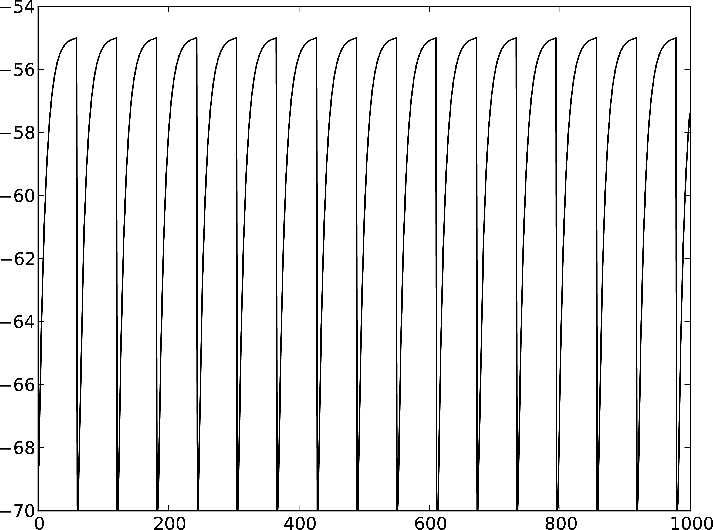
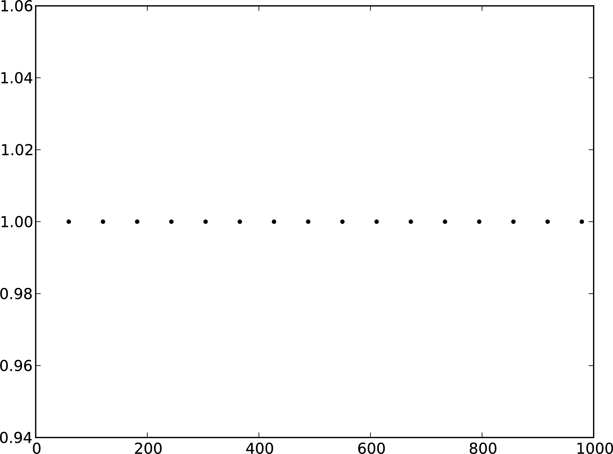
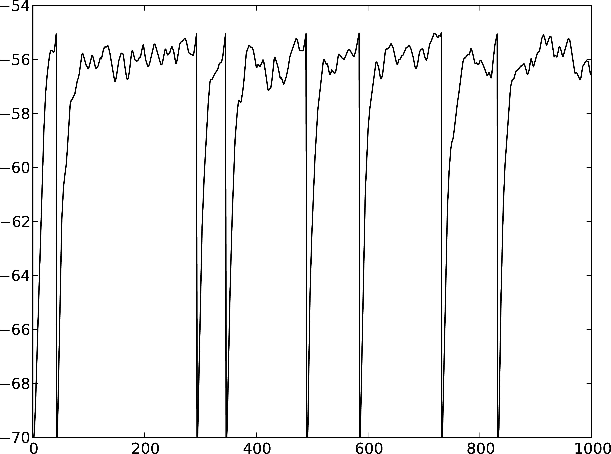
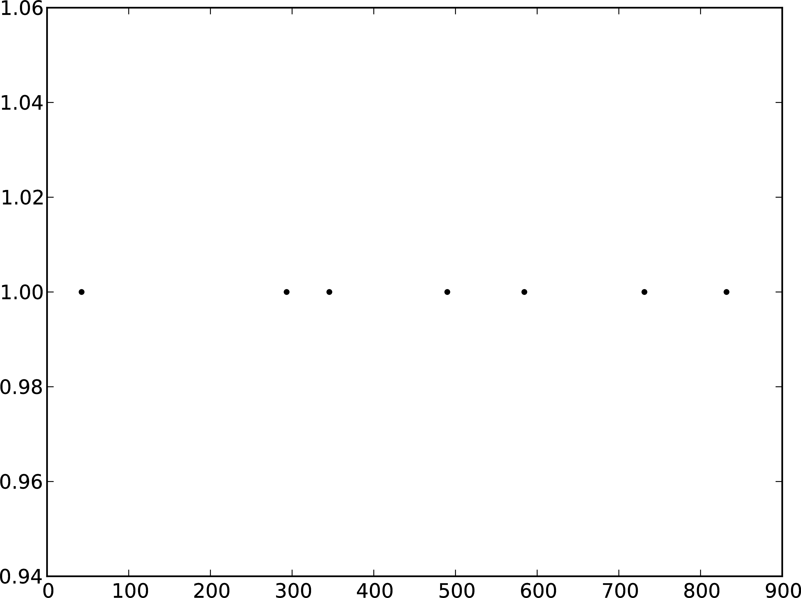
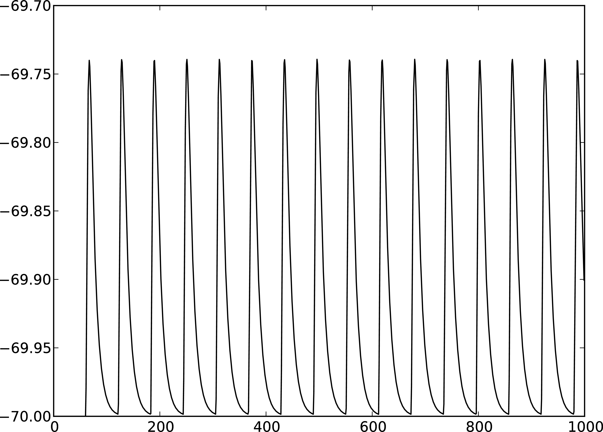

Part 1: Neurons and simple neural networks
==========================================

Introduction
============

In this handout we cover the first steps in using PyNEST to simulate neuronal networks. When you have worked through this material, you will know how to:

-   start PyNEST
-   create neurons and stimulating/recording devices
-   query and set their parameters
-   connect them to each other or to devices
-   simulate the network
-   extract the data from recording devices

For more information on the usage of PyNEST and for more advanced examples than discusses in this primer, please visit [nest-initiative.org/](http://nest-initiative.org/) or have a look at the source directory of your NEST installation in the subdirectory:
`pynest/examples/`. For the internals of the NEST simulator you may refer to the [publications](../publications/index.html "Publications").

PyNEST - an interface to the NEST simulator
===========================================

 The Python interpreter imports NEST as a module and dynamically loads the NEST simulator kernel (`pynestkernel.so`). The core functionality is defined in `hl_api.py`. A simulation script of the user (`mysimulation.py`) uses functions defined in this high-level API. These functions generate code in SLI (Simulation Language Interpreter), the native language of the interpreter of NEST. This interpreter, in turn, controls the NEST simulation kernel.

The NEural Simulation Tool (NEST: [www.nest-initiative.org](../part-1-neurons-and-simple-neural-networks/index.html)) is designed for the simulation of large heterogeneous networks of point neurons. It is open source software released under the GPL licence. The simulator comes with an interface to Python . illustrates the interaction between the user’s simulation script (`mysimulation.py`) and the NEST simulator. contains a technically detailed description of the implementation of this interface and parts of this text are based on this reference. The simulation kernel is written in$$ C++$$ to obtain highest possible performance for the simulation.

You can use PyNEST interactively from the Python prompt or from within ipython. This is very helpful when you are exploring PyNEST, trying to learn a new functionality or debugging a routine. Once out of the exploratory mode, you will find it saves a lot of time to write your simulations in text files. These can in turn be run from the command line or from the Python or ipython prompt.

Whether working interactively, semi-interactively, or purely executing scripts, the first thing that needs to happen is importing NEST’s functionality into the Python interpreter.

    import nest

As with every other module for Python, the available functions can be prompted for.

    dir(nest)

One such command is `nest.Models()`, which will return a list of all the available models you can use. If you want to obtain more information about a particular command, you may use Python’s standard help system.

    nest.Models()

This will return the help text (docstring) explaining the use of this particular function. There is a help system within NEST as well. You can open the help pages in a browser using `nest.helpdesk()` and you can get the help page for a particular object using `nest.help(object)`.

Creating Nodes
==============

A neural network in NEST consists of two basic element types: nodes and connections. Nodes are either neurons, devices or sub-networks. Devices are used to stimulate neurons or to record from them. Nodes can be arranged in sub-networks to build hierarchical networks such as layers, columns, and areas - we will get to this later in the course. For now we will work in the default sub-network which is present when we start NEST, known as the *root* *node*.

To begin with, the root sub-network is empty. New nodes are created with the command `Create`, which takes as arguments the model name of the desired node type, and optionally the number of nodes to be created and the initialising parameters. The function returns a list of handles to the new nodes, which you can assign to a variable for later use. These handles are integer numbers, called \*id\*s. Many PyNEST functions expect or return a list of ids (see ). Thus it is easy to apply functions to large sets of nodes with a single function call.

After having imported NEST and also the Pylab interface to Matplotlib , which we will use to display the results, we can start to create nodes. For a first example, we will create a neuron of type `iaf_neuron`. This neuron is an integrate-and-fire neuron with alpha-shaped postsynaptic currents. The function returns a list of the ids of all the created neurons, in this case only one, which we store in a variable called `neuron`.

    import pylab
    import nest
    neuron = nest.Create("iaf_neuron")

We can now use the id to access the properties of this neuron. Properties of nodes in NEST are generally accessed via Python dictionaries of key-value pairs of the form $$$texttt{{key : value}}$$$. In order to see which properties a neuron has, you may ask it for its status.

    nest.GetStatus(neuron)

This will print out the corresponding dictionary in the Python console. Many of these properties are not relevant for the dynamics of the neuron. To find out what the interesting properties are, look at the documentation of the model through the helpdesk. If you already know which properties you are interested in, you can specify a key, or a list of keys, as an optional argument to `GetStatus`:

    nest.GetStatus(neuron, "I_e")
    nest.GetStatus(neuron, ["V_reset", "V_th"])

In the first case we query the value of the constant background current `I_e`; the result is given as a tuple with one element. In the second case, we query the values of the reset potential and threshold of the neuron, and receive the result as a nested tuple. If `GetStatus` is called for a list of nodes, the dimension of the outer tuple is the length of the node list, and the dimension of the inner tuples is the number of keys specified.

To modify the properties in the dictionary, we use `SetStatus`. In the following example, the background current is set to $$$376.0pA$$$, a value causing the neuron to spike periodically.

    nest.SetStatus(neuron, {"I_e": 376.0})

Note that we can set several properties at the same time by giving multiple comma separated key:value pairs in the dictionary. Also be aware that NEST is type sensitive - if a particular property is of type `double`, then you do need to explicitly write the decimal point:

    nest.SetStatus(neuron, {"I_e": 376})

will result in an error. This conveniently protects us from making integer division errors, which are hard to catch.

Next we create a `multimeter`, a *device* we can use to record the membrane voltage of a neuron over time. We set its property `withtime` such that it will also record the points in time at which it samples the membrane voltage. The property `record_from` expects a list of the names of the variables we would like to record. The variables exposed to the multimeter vary from model to model. For a specific model, you can check the names of the exposed variables by looking at the neuron’s property `recordables`.

    multimeter = nest.Create("multimeter")
    nest.SetStatus(multimeter, {"withtime":True, "record_from":["V_m"]})

We now create a `spikedetector`, another device that records the spiking events produced by a neuron. We use the optional keyword argument `params` to set its properties. This is an alternative to using `SetStatus`. The property `withgid` indicates whether the spike detector is to record the source id from which it received the event (i.e. the id of our neuron).

    spikedetector = nest.Create("spike_detector",
                    params={"withgid": True, "withtime": True})

A short note on naming: here we have called the neuron `neuron`, the multimeter `multimeter` and so on. Of course, you can assign your created nodes to any variable names you like, but the script is easier to read if you choose names that reflect the concepts in your simulation.

Connecting nodes with default connections
=========================================

Now we know how to create individual nodes, we can start connecting them to form a small network.

    nest.Connect(multimeter, neuron)
    nest.Connect(neuron, spikedetector)

A &

B

Figure 2: A Membrane potential of integrate-and-fire neuron with constant input current. B
 Spikes of the neuron.

The order in which the arguments to `Connect` are specified reflects the flow of events: if the neuron spikes, it send an event to the spike detector. Conversely, the multimeter periodically sends requests to the neuron to ask for its membrane potential at that point in time. This can be regarded as a perfect electrode stuck into the neuron.

Now we have connected the network, we can start the simulation. We have to inform the simulation kernel how long the simulation is to run. Here we choose $$1000ms.$$

    nest.Simulate(1000.0)

Congratulations, you have just simulated your first network in NEST!

Extracting and plotting data from devices
=========================================

After the simulation has finished, we can obtain the data recorded by the multimeter.

    dmm = nest.GetStatus(multimeter)[0]
    Vms = dmm["events"]["V_m"]
    ts = dmm["events"]["times"]

In the first line, we obtain the list of status dictionaries for all queried nodes. Here, the variable `multimeter` is the id of only one node, so the returned list just contains one dictionary. We extract the first element of this list by indexing it (hence the `[0]` at the end). This type of operation occurs quite frequently when using PyNEST, as most functions are designed to take in and return lists, rather than individual values. This is to make operations on groups of items (the usual case when setting up neuronal network simulations) more convenient.

This dictionary contains an entry named `events` which holds the recorded data. It is itself a dictionary with the entries `V_m` and `times`, which we store separately in `Vms` and `ts`, in the second and third line, respectively. If you are having trouble imagining dictionaries of dictionaries and what you are extracting from where, try first just printing `dmm` to the screen to give you a better understanding of its structure, and then in the next step extract the dictionary `events`, and so on.

Now we are ready to display the data in a figure. To this end, we make use of `pylab`.

    import pylab
    pylab.figure(1)
    pylab.plot(ts, Vms)

The second line opens a figure (with the number 1), the third line clears the window and the fourth line actually produces the plot. You can’t see it yet because we have not used `pylab.show()`. Before we do that, we proceed analogously to obtain and display the spikes from the spike detector.

A &

B

Figure 3: A Membrane potential of integrate-and-fire neuron with Poisson noise as input. B
 Spikes of the neuron.

    dSD = nest.GetStatus(spikedetector,keys='events')[0]
    evs = dSD["senders"]
    ts = dSD["times"]
    pylab.figure(2)
    pylab.plot(ts, evs, ".")
    pylab.show()

Here we extract the events more concisely by using the optional keyword argument `keys` to `GetStatus`. This extracts the dictionary element with the key `events` rather than the whole status dictionary. The output should look like . If you want to execute this as a script, just paste all lines into a text file named, say, `one-neuron.py` . You can then run it from the command line by prefixing the file name with `python`, or from the Python or ipython prompt, by prefixing it with `run`.

Connecting nodes with specific connections
==========================================

A commonly used model of neural activity is the Poisson process. We now adapt the previous example such that the neuron receives $$2$$ Poisson spike trains, one excitatory and the other inhibitory. Hence, we need a new device, the `poisson_generator`. After line $$9$$ we create these two generators and set their rates to $$$80000Hz$$$ and $$$15000Hz,$$$ respectively.

    noise = nest.Create("poisson_generator", 2)
    nest.SetStatus(noise, [{"rate": 80000.0}, {"rate": 15000.0}])

Note that here we are using the optional argument to `Create` to indicate that we want to generate two devices. Similarly, in `SetStatus` we give a list of two dictionaries, as the variable `noise` conains the ids of two devices.

We can either remove line $$5$$ entirely or change it to set the constant input current to $$0$$:

    nest.SetStatus(neuron, {"I_e": 0.0})

Each event of the excitatory generator should produce a postsynaptic current of $$$1.2pA$$$ amplitude, an inhibitory event of $$$-2.0pA$$$. The synaptic weights can be defined in a dictionary, which is passed to the `Connect` function using the keyword `syn_spec` (synapse specifications). In general all parameters determining the synapse can be specified in the synapse dictionary, such as `"weight"`, `"delay"`, the synaptic model (`"model"`) and parameters specific to the synaptic model.

    syn_dict_ex = {"weight": 1.2}
    syn_dict_in = {"weight": -2.0}
    nest.Connect([noise[0]], neuron, syn_spec=syn_dict_ex)
    nest.Connect([noise[1]], neuron, syn_spec=syn_dict_in)

Figure 4: Postsynaptic potentials in `neuron2` evoked by the spikes of `neuron1`

Note once again the use of indexing to extract a particular element from the list returned by `Create`. The rest of the code remains as before. You should see a membrane potential as in Fig 3.

In the next part of the introduction we will look at more methods for connecting many neurons at once.

Two connected neurons
=====================

There is no additional magic involved in connecting neurons. To demonstrate this, we start from our original example of one neuron with a constant input current, and add a second neuron.

    import pylab
    import nest
    neuron1 = nest.Create("iaf_neuron")
    nest.SetStatus(neuron1, {"I_e": 376.0})
    neuron2 = nest.Create("iaf_neuron")
    multimeter = nest.Create("multimeter")
    nest.SetStatus(multimeter, {"withtime":True, "record_from":["V_m"]}

We now connect `neuron1` to `neuron2`, and record the membrane potential from `neuron2` so we can observe the postsynaptic potentials caused by the spikes of `neuron1`.

    nest.Connect(neuron1, neuron2, syn_spec = {"weight":20.0})
    nest.Connect(multimeter, neuron2)

Here the default delay of $$$1ms$$$ was used. If the delay is specified in addition to the weight, the following shortcut is available:

    weight = 20.0
    delay = 1.0
    nest.Connect(neuron1, neuron2, weight, delay)

Note that this shortcut is only available for creating exactly one connection between two nodes, it cannot be applied to populations of nodes (see next section). If you simulate the network and plot the membrane potential as before, you should then see the postsynaptic potentials of `neuron2` evoked by the spikes of `neuron1` as in .

Connected populations of neurons
================================

In the previous section we demonstrated how synapse parameters can be set in the synapse specifications. The connection patterns can be chosen by altering the connection specification (`conn_spec`). We extend the previous example can be extended to two populations of ten neurons each.

    import pylab
    import nest
    pop1 = nest.Create("iaf_neuron",10)
    nest.SetStatus(pop1, {"I_e": 376.0})
    pop2 = nest.Create("iaf_neuron",10)
    multimeter = nest.Create("multimeter",10)
    nest.SetStatus(multimeter, {"withtime":True, "record_from":["V_m"]}

If no connectivity pattern is specified, the populations are connected via the default rule, namely `"one_to_one"`. This means that the first neuron in `pop1` is connected to the first neuron in `pop2`, the second to the second, etc., creating ten connections in total.

    nest.Connect(pop1, pop2, syn_spec = {"weight":20.0})

Alternatively, each neuron of `pop1` can be connected to every neuron in `pop2`, which is accomplished by the rule `"all_to_all"`, thus resulting in $$102$$ connections.

    nest.Connect(pop1, pop2, "all_to_all", {"weight":20.0})

Finally, the multimeters are connected using the default rule

    nest.Connect(multimeter, pop2)

Here we have just used very simple connection schemes. Connectivity patterns requiring the specification of further parameters, such as in-degree or connection probabilities, must be defined in a dictionary containing the key `"rule"` and the key for parameters associated to the rule. Please see [../connection_management/index.html] for an illustrated guide to the usage of `Connect`.

Command overview
================

These are the functions we introduced for the examples in this handout; as the week progresses we will add more.

### Getting information about NEST

`Models(mtype="all", sel=None)`:  
Return a list of all available models (nodes and synapses). Use `mtype="nodes"` to only see node models, `mtype="synapses"` to only see synapse models. `sel` can be a string, used to filter the result list and only return models containing it.

`helpdesk(browser="firefox")`:  
Opens the NEST documentation pages in the given browser.

`help(obj=None,pager="less")`:  
Opens the help page for the given object.

### Nodes

`Create(model, n=1, params=None)`:  
Create `n` instances of type `model` in the current sub-network. Parameters for the new nodes can be given as `params` (a single dictionary, or a list of dictionaries with size `n`). If omitted, the `model`’s defaults are used.

`GetStatus(nodes, keys=None)`:  
Return a list of parameter dictionaries for the given list of `nodes`. If `keys` is given, a list of values is returned instead. `keys` may also be a list, in which case the returned list contains lists of values.

`SetStatus(nodes, params, val=None)`:  
Set the parameters of the given `nodes` to `params`, which may be a single dictionary, or a list of dictionaries of the same size as `nodes`. If `val` is given, `params` has to be the name of a property, which is set to `val` on the `nodes`. `val` can be a single value, or a list of the same size as `nodes`.

### Connections

This is an abbreviated version of the documentation for the `Connect` function, please see NEST’s online help for the full version and <http://www.nest-initiative.org/Connection_Management> for an introduction and worked examples.

`Connect(pre, post, conn_spec=None, syn_spec=None, model=None)`:  
Connect pre neurons to post neurons.Neurons in pre and post are connected using the specified connectivity (`"one_to_one"` by default) and synapse type (`"static_synapse"` by default). Details depend on the connectivity rule.Note: Connect does not iterate over subnets, it only connects explicitly specified nodes.`pre` - presynaptic neurons, given as list of GIDs `post` - presynaptic neurons, given as list of GIDs `conn_spec` - name or dictionary specifying connectivity rule, see below `syn_spec` - name or dictionary specifying synapses, see below**Connectivity:**Connectivity is either specified as a string containing the name of a connectivity rule (default: `"one_to_one"`) or as a dictionary specifying the rule and rule-specific parameters (e.g. `"indegree"`), which must be given. In addition switches allowing self-connections (`"autapses"`, default: `True`) and multiple connections between a pair of neurons (`"multapses"`, default: `True`) can be contained in the dictionary.

**Synapse:**

The synapse model and its properties can be inserted either as a string describing one synapse model (synapse models are listed in the synapsedict) or as a dictionary as described below. If no synapse model is specified the default model `"static_synapse"` will be used. Available keys in the synapse dictionary are `"model"`, `"weight"`, `"delay"`, `"receptor_type"` and parameters specific to the chosen synapse model. All parameters are optional and if not specified will use the default values determined by the current synapse model. `"model"` determines the synapse type, taken from pre-defined synapse types in NEST or manually specified synapses created via `CopyModel()`. All other parameters can be scalars or distributions. In the case of scalar parameters, all keys take doubles except for `"receptor_type"` which has to be initialised with an integer. Distributed parameters are initialised with yet another dictionary specifying the distribution (`"distribution"`, such as `"normal"`) and distribution-specific paramters (such as `"mu"` and `"sigma"`).

### Simulation control

`Simulate(t)`:  
Simulate the network for `t` milliseconds.

References
==========

-   Marc-Oliver Gewaltig and Markus Diesmann. (NEural Simulation Tool). , 2(4):1430, 2007.
-   J. M. Eppler, M. Helias, E. Muller, M. Diesmann, and M. Gewaltig. : a convenient interface to the NEST simulator. , 2:12, 2009.
-   John D. Hunter. Matplotlib: A 2d graphics environment. , 9(3):90–95, 2007.
-   Abigail Morrison, Sirko Straube, Hans Ekkehard Plesser, and Markus Diesmann. Exact subthreshold integration with continuous spike times in discrete time neural network simulations. , 19(1):47–79, 2007.
-   Python Software Foundation. The Python programming language, 2008. http://www.python.org.
