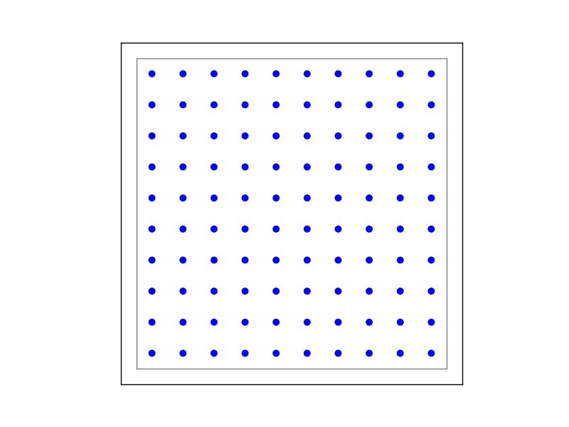
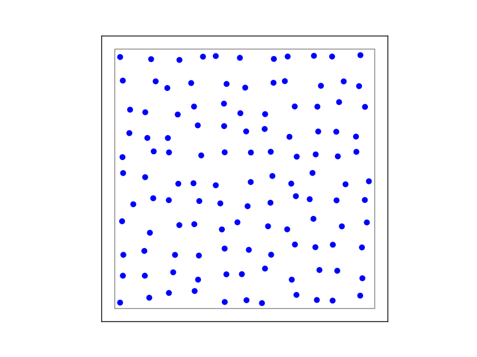
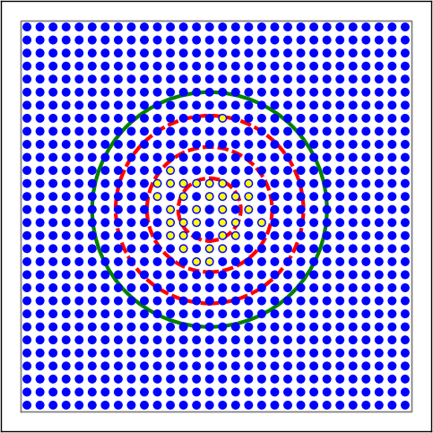
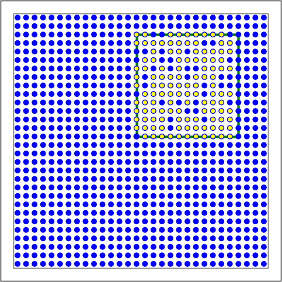
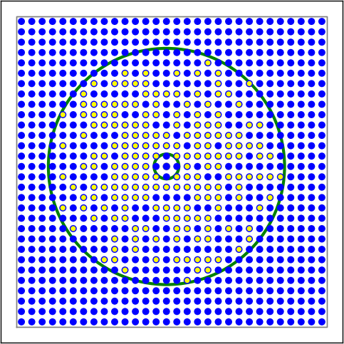
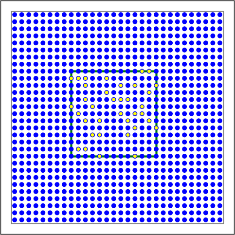

Part 4: Topologically structured networks
=========================================

Introduction
============

This handout covers the use of NEST’s `topology` library to construct structured networks. When you have worked through this material you will be able to:

-   Create populations of neurons with specific spatial locations
-   Define connectivity profiles between populations
-   Connect populations using profiles
-   Visualise the connectivity

For more information on the usage of NEST, please visit:
[http://www.nest-simulator.org/documentation/](../documentation/index.html))>

Incorporating structure in networks of point neurons
====================================================

If we use biologically detailed models of a neuron, then it’s easy to understand and implement the concepts of topology, as we already have dendritic arbors, axons, etc. which are the physical prerequisites for connectivity within the nervous system. However, we can still get a level of specificity using networks of point neurons.

Structure, both in the topological and everyday sense, can be thought of as a set of rules governing the location of objects and the connections between them. Within networks of point neurons, we can distinguish between three types of specificity:

-   Cell-type specificity – what sorts of cells are there?
-   Location specificity – where are the cells?
-   Projection specificity – which cells do they project to, and how?

In the previous handouts, we saw that we can create deterministic or randomly selected connections between networks using `Connect()`. If we want to create network models that incorporate the spatial location and spatial connectivity profiles, it is time to turn to the `topology` module. **NOTE:** Full documentation for usage of the topology module is present in NEST Topology Users Manual (NTUM) [1], which in the following pages is referenced as a full-source.

The nest.topology module
========================

The `nest.topology` module allows us to create populations of nodes with a given spatial organisation, connection profiles which specify how neurons are to be connected, and provides a high-level connection routine. We can thus create structured networks by designing the connection profiles to give the desired specificity for cell-type, location and projection.

The generation of structured networks is carried out in three steps, each of which will be explained in the subsequent sections in more detail:

1.  **Defining layers**, in which we assign the layout and types of the neurons within a layer of our network.
2.  **Defining connection profiles**, where we generate the profiles that we wish our connections to have. Each connection dictionary specifies the properties for one class of connection, and contains parameters that allow us to tune the profile. These are related to the location-dependent likelihood of choosing a target (`mask` and `kernel`), and the cell-type specificity i.e. which types of cell in a layer can participate in the connection class (`sources` and `targets`).
3.  **Connecting layers**, in which we apply the connection dictionaries between layers, equivalent to population-specificity. Note that multiple dictionaries can be applied between two layers, just as a layer can be connected to itself.
4.  **Auxillary**, in which we visualise the results of the above steps either by `nest.PrintNetwork()` or visualization functions included in the topology module and query the connections for further analysis.

Defining layers
===============

The code for defining a layer follows this template:

    import nest.topology as topp
    my_layer_dict = {...} # see below for options
    my_layer = topp.CreateLayer(my_layer_dict)

where `my_layer_dict` will define the elements of the layer and their locations.

The choice of nodes to fill the `layer` is specified using the `elements` key. For the moment, we’ll only concern ourselves with creating simple layers, where each element is from a homogeneous population. Then, the corresponding value for this dictionary entry should is the model type of the neuron, which can either be an existing model in the `NEST` collection, or one that we’ve previously defined using `CopyModel()`.

We next have to decide whether the nodes should be placed in a **grid-based** or **free** (off-grid) fashion, which is equivalent to asking \`\`can the elements of our network be regularly and evenly placed within a 2D network, or do we need to tell them where they should be located?".

A  B 

Figure 1: Example of (A) on-grid and (B) off-grid, in which the neurons are positioned as
 grid+jitter.

#### 1) On-grid:

we have to explicitly specify the size and spacing of the grid, by the number or rows *m* and columns *n* as well as the extent (layer size). The grid spacing is then determined from these, and *n*x*m* elements are arranged symmetrically. Note that we can also specify a center to the grid, else the default offset is the origin.

The following snippet produces Fig. [fig:onoffgrid]A:

    layer_dict_ex = {"extent" : [2.,2.], # the size of the layer in mm
            "rows" : 10, # the number of rows in this layer ...
            "columns" : 10, # ... and the number of columns
            "elements" : "iaf_neuron"} # the element at each (x,y) coordinate in the grid

#### 2) Off grid:

we define only the elements, their positions and the extent. The number of elements created is equivalent to the length of the list of positions. This option allows much more flexibility in how we distribute neurons. Note that we should also specify the extent, if the positions fall outside of the default (extent size = [1,1] and origin as the center). See Section 2.2 in NUTM for more details.

The following snippet produces Fig. [fig:onoffgrid] B:

    import numpy as np
    # grid with jitter
    jit = 0.03
    xs = np.arange(-0.5,.501,0.1)
    poss = [[x,y] for y in xs for x in xs]
    poss = [[p[0]+np.random.uniform(-jit,jit),p[1]+np.random.uniform(-jit,jit)] for p in poss]
    layer_dict_ex = {"positions": poss,
            "extent" : [1.1,1.1],
            "elements" : "iaf_neuron"}

Note: The topology module does support 3D `layer`s, but this is outside the scope of this handout.

An overview of all the parameters that can be used, as well as whether they are primarily used for grid-based or free layers, follows:

| Parameter  | Grid | Description                                                                                                                | Possible values                                           |
|------------|------|----------------------------------------------------------------------------------------------------------------------------|-----------------------------------------------------------|
| elements   | Both | Type of model to be included in the network                                                                                | Any model listed in `nest.Models()` or user-defined model |
| extent     | Both | Size of the layer in mm. Default is [1.,1.]                                                                                | 2D list                                                   |
| rows       | On   | Number of rows                                                                                                             | int                                                       |
| columns    | On   | Number of columns                                                                                                          | int                                                       |
| center     | On   | The center of the grid or free layer. Allows for grids to be structured independently of each other (see Fig. 2.3 in NTUM) | 2D list                                                   |
| positions  | Off  | List of positions for each of the neurons to be created.                                                                   | List of lists or tuples                                   |
| edge\_wrap | Both | Whether the layer should have a periodic boundary or not. Default: False                                                   | boolean                                                   |

#### Advanced:

**Composite layers** can also be created. This layer type extends the grid-based layer and allows us to define a number of neurons and other elements, such as `poisson_generators`, at each grid location. A full explanation is available in Section 2.5 of NTUM. The advantages in this approach is that, if we want to have a layer in which each element or subnetwork has the same composition of components, then it’s very easy to define a layer which has these properties. For a simple example, let’s consider a grid of elements, where each element comprises of 4 pyramidal cells, 1 interneuron, 1 poisson generator and 1 noise generator. The corresponding code is:

    nest.CopyModel("iaf_neuron","pyr")
    nest.CopyModel("iaf_neuron","inh", {"V_th": -52.})
    comp_layer = topp.CreateLayer({"rows":5,"columns":5,
            "elements": ["pyr",4,"inh","poisson_generator","noise_generator"]})

Defining connection profiles
============================

To define the types of connections that we want between populations of neurons, we specify a *connection dictionary*.

The only two mandatory parameters for any connection dictionary are `connection_type` and `mask`. All others allow us to tune our connectivity profiles by tuning the likelihood of a connection, the synapse type, the weight and/or delay associated with a connection, or the number of connections, as well as specifying restrictions on cell types that can participate in the connection class.

Chapter 3 in NTUM deals comprehensively with all the different possibilities, and it’s suggested that you look there for learning about the different constraints, as well as reading through the different examples listed there. Here are some representative examples for setting up a connectivity profile, and the following table lists the parameters that can be used.

A 

B 
 C 

D 

Figure 2: Examples of connectivity for each of the connectivity dictionaries mentioned in the
 following Python code snippet.

    # Circular mask, gaussian kernel.
    conn1 = {  "connection_type":"divergent",
                "mask": {"circular":{"radius":0.75}},
                "kernel": {"gaussian":{"p_center":1.,"sigma":0.2}},
                "allow_autapses":False
                }

    # Rectangular mask, constant kernel, non-centered anchor
    conn2 = {   "connection_type":"divergent",
                "mask": {"rectangular":{"lower_left":[-0.5,-0.5],"upper_right":[0.5,0.5]},
                            "anchor": [0.5,0.5],
                        },
                "kernel": 0.75,
                "allow_autapses":False
                }

    # Donut mask, linear kernel that decreases with distance
    # Commented out line would allow connection to target the pyr neurons (useful for composite layers)
    conn3 = {   "connection_type": "divergent",
                "mask": {"doughnut":{"inner_radius":0.1,"outer_radius":0.95}},
                "kernel": {"linear": {"c":1.,"a":-0.8}},
                #"targets":"pyr"
            }

    # Rectangular mask, fixed number of connections, gaussian weights, linear delays
    conn4 = {   "connection_type":"divergent",
                "mask": {"rectangular":{"lower_left":[-0.5,-0.5],"upper_right":[0.5,0.5]}},
                "number_of_connections": 40,
                "weights": {"gaussian":{"p_center":J,"sigma":0.25}},
                "delays" : {"linear" :{"c":0.1,"a":0.2}},
                "allow_autapses":False
                }

| Parameter               | Description                                                                                                                                                                                                        | Possible values                                                          |
|-------------------------|--------------------------------------------------------------------------------------------------------------------------------------------------------------------------------------------------------------------|--------------------------------------------------------------------------|
| connection\_type        | Determines how nodes are selected when connections are made                                                                                                                                                        | convergent, divergent                                                    |
| mask                    | Spatially selected subset of neurons considered as (potential) targets                                                                                                                                             | circular, rectangular, doughnut, grid                                    |
| kernel                  | Function that determines the likelihood of a neuron being chosen as a target. Can be distance-dependent or -independent.                                                                                           | constant, uniform, linear, gaussian, exponential, gaussian2D             |
| weights                 | Distribution of weight values of connections. Can be distance-dependent or -independent. **NB**: this value overrides any value currently used by synapse\_model, and therefore unless defined will default to 1.! | constant, uniform, linear, gaussian, exponential                         |
| delays                  | Distribution of delay values for connections. Can be distance-dependent or -independent. **NB**: like weights, this value overrides any value currently used by synapse\_model!                                    | constant, uniform, linear, gaussian, exponential                         |
| synapse\_model          | Define the type of synapse model to be included.                                                                                                                                                                   | any synapse model included in `nest.Models()`, or currently user-defined |
| sources                 | Defines the sources (presynaptic) neurons for this connection.                                                                                                                                                     | any neuron label that is currently user-defined                          |
| targets                 | Defines the target (postsynaptic) neurons for this connection.                                                                                                                                                     | any neuron label that is currently user-defined                          |
| number\_of\_connections | Fixes the number of connections that this neuron is to send, ensuring we have a fixed out-degree distribution.                                                                                                     | int                                                                      |
| allow\_multapses        | Whether we want to have multiple connections between the same source-target pair, or ensure unique connections.                                                                                                    | boolean                                                                  |
| allow\_autapses         | Whether we want to allow a neuron to connect to itself                                                                                                                                                             | boolean                                                                  |

Connecting layers
=================

Connecting layers is the easiest step: having defined a source layer, a target layer and a connection dictionary, we simply use the function `topp.ConnectLayers()`:

    ex_layer = topp.CreateLayer({"rows":5,"columns":5,"elements":"iaf_neuron"})
    in_layer = topp.CreateLayer({"rows":4,"columns":4,"elements":"iaf_neuron"})
    conn_dict_ex = {"connection_type":"divergent","mask":{"circular":{"radius":0.5}}}
    # And now we connect E->I
    topp.ConnectLayers(ex_layer,in_layer,conn_dict_ex)

Note that we can define several dictionaries, use the same dictionary multiple times and connect to the same layer:

    # Extending the code from above ... we add a conndict for inhibitory neurons
    conn_dict_in = {"connection_type":"divergent",
            "mask":{"circular":{"radius":0.75}},"weights":-4.}
    # And finish connecting the rest of the layers:
    topp.ConnectLayers(ex_layer,ex_layer,conn_dict_ex) # Connect E->E
    topp.ConnectLayers(in_layer,in_layer,conn_dict_in) # Connect I->I
    topp.ConnectLayers(in_layer,ex_layer,conn_dict_in) # Connect I->E

Visualising and querying the network structure
==============================================

There are two main methods that we can use for checking that our network was built correctly:

-   **nest.PrintNetworks(depth=1)** which prints out all the neurons and subnetworks within the network in text form. This is a good manner in which to inspect the hierarchy of composite layers;
-   **create plots using functions in `nest.topology`**. There are three functions that can be combined: `PlotLayer`, `PlotTargets` and `PlotKernel`, which allow us to generate the plots used with NUTM and this handout. See Section 4.2 of NTUM for more details.

Other useful functions that may be of help, in addition to those already listed in NTUM Section 4.1, are:

| Function                         | Description                                                                               |
|----------------------------------|-------------------------------------------------------------------------------------------|
| nest.GetNodes(layer)             | Returns GIDs of layer elements: either nodes or top-level subnets (for composite)         |
| nest.GetLeaves(layer)            | Returns GIDs of leaves of a structure, which is always going to be neurons rather subnets |
| topp.GetPosition(gids)           | Returns position of elements specified in input                                           |
| nest.GetStatus(layer,“topology”) | Returns the layer dictionary for a layer                                                  |

References
==========

1.  Hans Ekkehard Plesser and Håkon Enger NEST Topology User Manual

Acknowledgments
===============

This handout is based on a previous document by Sarah Jarvis, many thanks to her.
