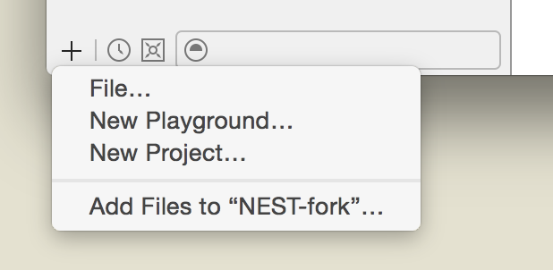
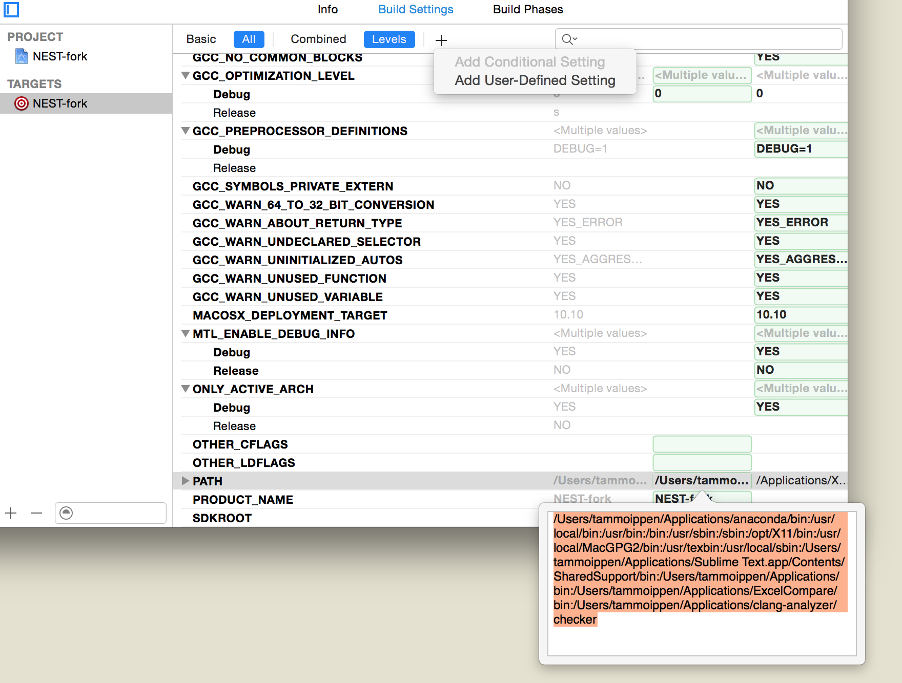
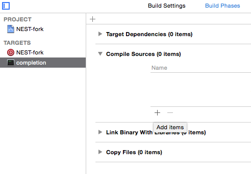

[« Back to the index](index)

# Xcode Workflow

This article contains instructions on how to develop NEST on a Mac (OSX 10.10.3 as of this writing) using Xcode (Version 6.3.2). As the shipped gcc, aka clang (based on LLVM 3.6.0svn), does not support OpenMP and there is no MPI shipped by default, this also explains, how to get a proper gcc (with OpenMP and MPI enabled) installed on Mac.

## Setup Infrastructure

We need several packages installed, before we can become productive with NEST:

* gcc
* openmpi 1.6
* gsl
* autoconf
* automake
* libtool
* ipython, python, cython, ... The best way to install all the python requirements is to use [Anaconda](https://store.continuum.io/cshop/anaconda/).

We present two ways to install the rest: MacPorts and Homebrew. For both versions you need to have Xcode and Xcode command line tools installed:

1. Install Xcode from the AppStore.
1. Install the Xcode command line tools by executing the following line in the Terminal and following the instructions in the windows that will pop up

        xcode-select --install

### Homebrew

1. Follow the install instructions for Homebrew ([short](http://brew.sh/) or [long](https://github.com/Homebrew/homebrew/blob/master/share/doc/homebrew/Installation.md#installation))
1. Open up the Terminal and execute the following lines:

        brew install gcc gsl autoconf automake libtool
1. NEST on Mac requires OpenMPI 1.6 to work properly, so we have to get this older version from Homebrew

        brew tap homebrew/versions
1. Since every package is compiled using th Mac supplied gcc, aka clang, but we want OpenMP to wrap around the Homebrew-gcc, we have to alter the openmpi-installation script. Assuming we installed Homebrew gcc 5.1.0, the executable is called `gcc-5` or `g++-5`, the script can be changed this way:

        brew edit open-mpi16
In the `def install` function add the `CC` and `CXX` lines to the `args` variable like this:

        args = %W[
          --prefix=#{prefix}
          --disable-dependency-tracking
          --disable-silent-rules
          --enable-ipv6
          CC=gcc-5         # these are the
          CXX=g++-5        # important lines
        ]
1. Install OpenMPI with the following line:

        brew install open-mpi16

### MacPorts

1. Follow the install instructions for [MacPorts](https://www.macports.org/install.php).
1. Open up the Terminal and execute the following lines:

        sudo port install gcc48
        sudo port select gcc mp-gcc48 # make gcc-48 the default compiler
        sudo port install gsl +gcc48
        sudo port install autoconf automake libtool    # build tools
1. NEST on Mac requires OpenMPI 1.6 to work properly, so we have to get this older version for MacPort. Download the portsfile [Portfile-openmpi-1.6.4.txt](http://www.nest-simulator.org/wp-content/uploads/2014/12/Portfile-openmpi-1.6.4.txt) and save it under the name `Portfile` in an arbitraty directory.
1. In Terminal, move to the directory containing Portfile and run

        sudo port install +gcc48 +threads configure.compiler=macports-gcc-4.8

## Install NEST

1. Get NEST from Github. You should follow the `Fork` / `Pull Request` process and clone from your fork:

        cd <somebase>
        mkdir NEST
        cd NEST
        mkdir src build install
        git clone https://github.com/nest/nest-simulator.git src
Afterwards you should have a directory structure like:

        <somebase>/NEST/
          - src/
          - build/
          - install/
1. Build NEST

        cd src
        ./bootstrap.sh
        cd ../build

        # with Homebrew infrastructure run:
        $PWD/../src/configure --prefix=$PWD/../install --with-openmp --with-mpi CC=mpicc CXX=mpicxx
        # with MacPorts infrastructure run:
        $PWD/../src/configure --prefix=$PWD/../install --with-openmp --with-mpi CC=openmpicc CXX=openmpicxx

        make -j8    # run make with 8 processes
        make install 
        make installcheck
It is important, that the `configure` command is _not_ executed with relative paths, in order for Xcode to find source files mentioned in the build logs.

## Get Xcode working with NEST

1. Create a new project, which we will call `NEST-fork` in this article. Click File -> New -> Project... -> OS X -> Other -> External Build System (with build tool `/usr/bin/make`)
1. Add the NEST sources to the project. There is a `+` in the left-bottom corner (see image). Click `Add Files to "NEST-fork"...`. Then select the `<somebase>/NEST/src/` folder (do not copy items and use groups).
    
  Also add the generated files:

        <somebase>/NEST/build/libnestutil/config.h
        <somebase>/NEST/build/libnestutil/sliconfig.h
        <somebase>/NEST/build/nest/static_modules.h
1. On the left panel select the newly created project `NEST-fork`, then select the created target:
    
  Here you set set Directory to `<somebase>/NEST/build`. This will be the directory, in which the `make` command is executed. Also check `Pass build settings in environment`.
1. Next select the `Build Settings` panel.
    
  Here you `Add User-Defined Setting` and name it `PATH`. In the `NEST-fork` column (the second) you copy the content of your `PATH` variable (do `echo $PATH` in the Terminal).
1. The build system (CMD+B) should work from now on.

### Running NEST from Xcode

We have to edit the Targets Scheme:

1. In the menu select: Product -> Scheme -> Manage Schemes...
1. Select the `NEST-fork` target and hit `Edit...`
1. Select the `Run` option on the left and then on the right select `Info`.
1. As `Executable` select `<somebase>/NEST/install/bin/nest`.
1. You can specify arguments in the `Arguments` panel.

__Note:__ The executable `<somebase>/NEST/install/bin/nest` will only be updated, if you execute `make install` in the terminal.

### Code Completion in Xcode

We have to create a new target and configure it appropriately:

1. In the menu select: File -> New -> Target....
1. Make the target a OS X -> Command Line Tool (Next), of type C++ in your project (preselected). We call it `completion`
1. Remove all files and folders that are created with the new target.
1. In the tab "Build Phase" of the new target, under "Compile Sources" add all `*.h`, `*.hpp`, `*.c`, `*.cc`, `*.cpp` files from the list (you can use CMD+a). 
1. Now Xcode generates its index and after that code completion should work.
